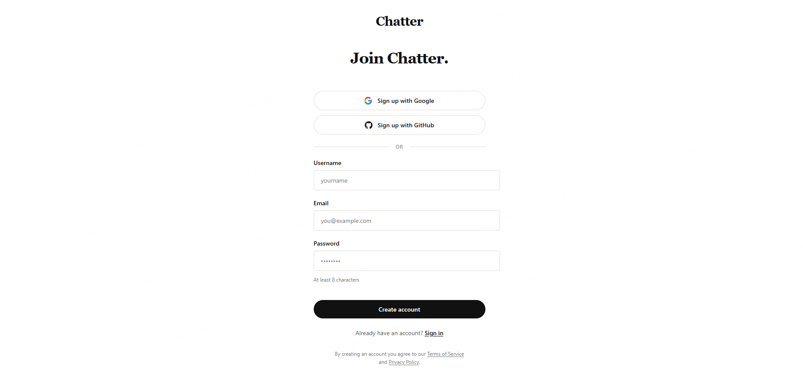

# Chatter

Chatter is a full-stack, Medium-style publishing platform built for writers who want a clean space to write, share, and connect with readers in real time.

🔗 **Live app:** [chatter-ebon.vercel.app](https://chatter-ebon.vercel.app/)

## Overview

Chatter combines a distraction-free writing experience with a social layer, so publishing content and building an audience happen in one place. It includes a rich text editor, a personalized feed, social interactions, live notifications, and analytics for tracking how your writing performs.

## Preview

**Landing page**


**Sign up**



## Features

- **Rich Text Editor** – Powered by Tiptap, supporting formatted writing similar to Medium's editor
- **Feed System** – A personalized content feed for discovering and following writers
- **Social Layer** – Follow, like, comment, and engage with other writers and their posts
- **Real-Time Notifications** – Instant updates for likes, comments, follows, and other activity
- **Analytics Dashboard** – Visual insights into post performance and reader engagement, built with Recharts
- **Authentication** – Secure sign-up and login flow handled through Supabase Auth

## Tech Stack

| Layer | Technology |
|---|---|
| Build Tool | Vite |
| Framework | React |
| Language | TypeScript |
| Styling | Tailwind CSS |
| Routing | React Router v7 |
| Rich Text Editor | Tiptap |
| Backend / Database | Supabase |
| Charts & Analytics | Recharts |

## Getting Started

### Prerequisites

- Node.js (v18 or higher recommended)
- A Supabase project (URL and anon key)

### Installation

1. Clone the repository
```bash
git clone <repository-url>
cd chatter
```

2. Install dependencies
```bash
npm install
```

3. Set up environment variables

Create a `.env` file in the root directory:
```
VITE_SUPABASE_URL=your_supabase_url
VITE_SUPABASE_ANON_KEY=your_supabase_anon_key
```

4. Run the development server
```bash
npm run dev
```

### Seeding the Database

A seed script is included to populate the database with sample data for local development.

```bash
npm run seed
```

## Project Structure

```
chatter/
├── src/
│   ├── components/     # Reusable UI components
│   ├── pages/           # Route-level page components
│   ├── features/         # Feature-specific logic (feed, auth, notifications, etc.)
│   ├── lib/              # Supabase client and utility functions
│   ├── hooks/            # Custom React hooks
│   └── routes/           # React Router route definitions
├── supabase/
│   └── seed.sql          # Database seed script
└── public/
```

## Deployment

Chatter is deployed and live at **[chatter-ebon.vercel.app](https://chatter-ebon.vercel.app/)**.

| Layer | Provider |
|---|---|
| Frontend | Vercel |
| Database / Auth / Realtime | Supabase |

Pushing to the main branch triggers a new deployment on Vercel automatically. Environment variables (Supabase URL and anon key) are configured in the Vercel project settings rather than committed to the repo.

## Roadmap

- Draft autosave
- Content bookmarking and reading lists
- Improved search and discovery
- Mobile-responsive polish

## Contributing

This project is currently maintained as a solo portfolio project. Feedback and suggestions are welcome through issues.

## License

MIT